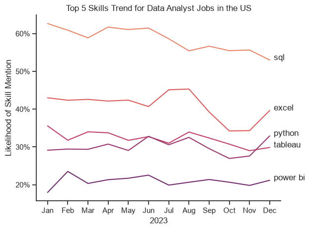
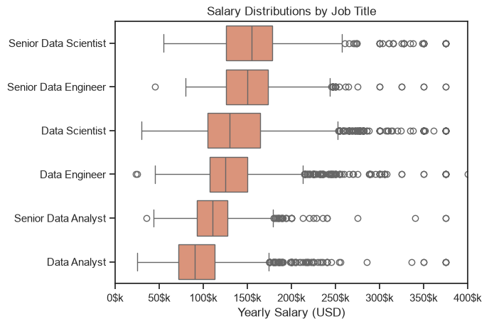
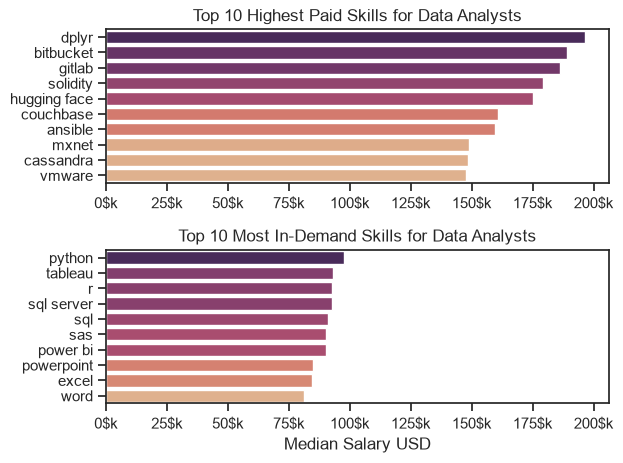
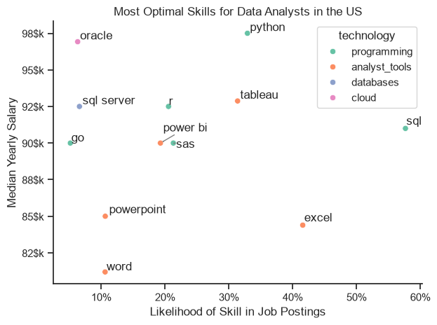

# Overview

This is the final project from a [YouTube course on Python for Data Analysts](https://www.youtube.com/watch?v=wUSDVGivd-8). The project structure and datasets were provided as part of the course since it is a guided learning project. However, all analyses, visualizations, and insights presented here were completed independently by me.

# The Questions

The main questions this project aims to answer are:

1. What are the most in-demand skills for Data Analysts?
2. How did the demand for Data Analyst skills change throughout 2023?
3. How does the salary distribution vary across the most relevant data roles, and which skills are associated with the highest salaries?
4. Which skills offer the best combination of high demand and high salary for Data Analysts?

# Tools I Used

* **Python:** The core tool used throughout the project and the main reason I took this course. I used Python to clean, transform, analyze, and visualize the dataset in order to extract meaningful insights. The main libraries I used were:
   * **Pandas:** For data cleaning, manipulation, and analysis.
   * **Matplotlib:** For creating data visualizations.
   * **Seaborn:** For building more advanced and aesthetically appealing visualizations.
* **Jupyter Notebook:** Used to develop, test, and iterate on the analysis in an interactive environment before finalizing the code.
* **VSCode:** Used as the primary code editor to organize the project and run Python scripts.
* **GitHub:** Used for version control and to share the project with others.

# Data Preparation and Clean up

This section outlines the steps taken to prepare the data for analysis, ensuring accuracy and usability.

## Import & Clean Up Data

I start by importing necessary libraries and loading the dataset, followed by initial data cleaning tasks to ensure data quality.

```python
# Importing Libraries

import pandas as pd
import matplotlib.pyplot as plt
import seaborn as sns
import ast
from datasets import load_dataset

# Loading the dataset

dataset = load_dataset("lukebarousse/data_jobs")
df = dataset['train'].to_pandas()

# Dataset Cleaning

df['job_posted_date'] = pd.to_datetime(df['job_posted_date'])
df['job_skills'] = df['job_skills'].apply(lambda x: ast.literal_eval(x) if pd.notna(x) else x)
```

## Filter US jobs

To focus my analysis on the U.S. job market, I apply filters to the dataset, narrowing down to roles based in the United States.

```python
df_US = df[df['job_country'] == 'United States']
```

# The Analysis
## 1. What are the most demanded skills for the 3 most popular data roles?

To find the most demanded skills for the top 3 most popular jobs I filtered out those positions by which one were the most popular (more appearances on the dataset), and got the top 5 skills for those roles.
This query highlights the most popular roles and the 5 top skills associated to them, showing what skills I should pay attention to depending on the role I'm targeting.

View my notebook with detailed steps here: 
[2_Skills_Demand.ipynb](2_My_Project/2_Skills_Demand.ipynb)

### Visualizing Data 

```python
fig, ax = plt.subplots(len(job_titles), 1)

sns.set_theme(style='ticks')

for i, job_title in enumerate(job_titles):
   df_plot = df_percent_skills[df_percent_skills['job_title_short'] == job_title].head(5)
   sns.barplot(data=df_plot, x='skills_percent', y='job_skills', ax=ax[i], hue='skills_count')
   ax[i].set_title(job_title)
   ax[i].set_xlabel('')
   ax[i].set_ylabel('')
   ax[i].legend().set_visible(False)
   ax[i].set_xlim(0,78)
   
   for n, v in enumerate(df_plot['skills_percent']):
      ax[i].text(v + 1, n, f'{v:.0f}%', va='center')
   
   if i != len(job_titles) - 1:
      ax[i].set_xticks([])

plt.suptitle('Likelihood of Skills Requested in US Job Postings', fontsize=16)
plt.tight_layout(h_pad=0.5)
plt.show()

```
### Results


### Insights

* Python is one of the most important skills for **Data Engineers** and **Data Scientists**, while it is less common in **Data Analyst** roles, appearing in about **27%** of Data Analyst job postings.
* SQL is a key skill across all three roles, showing how essential it is for working in data.
* Cloud technologies are especially important for **Data Engineer** positions, where working with cloud platforms is a common requirement.
* For **Data Analyst** roles, **Excel** and **data visualization tools** are the second and third most requested skills, highlighting their importance for data analysis and reporting.


## 2. How are in-demand skills trending for Data Analysts?

```python 
df_plot = df_percent.iloc[:,:5]
sns.lineplot(data=df_plot, dashes=False, palette='flare')
sns.set_theme(style='ticks')
sns.despine()

plt.title('Top 5 Skills Trend for Data Analyst Jobs in the US')
plt.ylabel('Likelihood of Skill Mention')
plt.xlabel('2023')
plt.legend().remove()

from matplotlib.ticker import PercentFormatter
ax = plt.gca()
ax.yaxis.set_major_formatter(PercentFormatter(decimals=0))


for i in range(5):
    plt.text(11.2, df_plot.iloc[-1, i], df_plot.columns[i])

plt.tight_layout()
plt.show()
```

### Results



*Line chart visualizing the trending top skills for data analysts in the US in 2023*

### Insights

* **SQL** shows a fairly steady presence in job postings throughout the year, standing out from the other skills by appearing in more than 50% of postings every month.
* **Excel** remains the second most in-demand skill for Data Analysts, although its presence in job postings decreases slightly from August to October.
* **Python, Tableau** and **Power BI** also remain relatively steady throughout the year. Python and Tableau appear in around 30–35% of job postings, while Power BI appears in approximately 20%.

## 3. How well do jobs and skills pay for Data Analysts?

### Salary Analysis

#### Visualize Data

```python
sns.boxplot(
        data=df_jobs_top6, 
        y='job_title_short', 
        x='salary_year_avg',
        order=jobs_order
    )
sns.set_theme(style='ticks', palette='flare')

plt.title('Salary Distributions by Job Title')
plt.ylabel('')
plt.xlabel('')

from matplotlib.ticker import FuncFormatter

ax = plt.gca()
ax.set_xlim(0,400000)
ax.xaxis.set_major_formatter(FuncFormatter(lambda x, pos: f'{x/1000:.0f}$k'))
```
#### Results

  

*Box plot visualizing the salary distributions for the top 6 data jobs.*  

#### Insights

* **Data Analyst** roles have the lowest median salaries (around $90,000), while **Senior Data Analyst** roles are slightly higher (around $110,000). Both roles show a more concentrated distribution (lower IQR) compared to other data roles. However, Data Analyst roles also present several high-salary outliers.
* **Data Engineer** and **Data Scientist** roles are the next highest-paid positions. **Data Engineer** salaries are more tightly concentrated around the median compared to **Data Scientist** roles. Both categories show multiple high-salary outliers.
* **Senior Data Engineer** and **Senior Data Scientist** roles have the highest median salaries overall, highlighting a clear salary gap between junior and senior positions.

### Skills Analysis

```python
sns.barplot(data=df_top_pay, x='median', y='job_skills', ax=ax[0], hue='median', palette='flare')

ax[0].legend().remove()
ax[0].set_title('Top 10 Highest Paid Skills for Data Analysts')
ax[0].set_ylabel('')
ax[0].set_xlabel('')
ax[0].xaxis.set_major_formatter(FuncFormatter(lambda x, pos: f'{x/1000:.0f}$k'))

sns.barplot(data=df_top_skills, x='median', y='job_skills', ax=ax[1], hue='median', palette='flare')
ax[1].legend().remove()
ax[1].set_title('Top 10 Most In-Demand Skills for Data Analysts')
ax[1].set_ylabel('')
ax[1].set_xlabel('Median Salary USD')
ax[1].set_xlim(ax[0].get_xlim()) # Set the same x-axis limits as the first plot
ax[1].xaxis.set_major_formatter(FuncFormatter(lambda x, pos: f'{x/1000:.0f}$k'))
```
#### Results

  

*Box plots visualizing the salaries related to the highest paid skills and the salaries for the top 10 most in-demand skills.*  

#### Insights

* The **10 highest-paying skills for Data Analysts** (with average salaries ranging from $150K to $200K) cover a wide range of technologies, showing that specialized technical knowledge is highly valued. The best-paid skills are mainly related to:
   * R libraries for data manipulation (dplyr).
   * Version control and DevOps tools for working with Git repositories (Bitbucket, GitLab).
   * Programming languages (Solidity).
   * AI and Machine Learning (Hugging Face, MXNet).
   * Databases (Couchbase, Cassandra).
   * Infrastructure automation / DevOps (Ansible).
   * Virtualization and cloud infrastructure (VMware).
* The **most in-demand skills for Data Analysts** are associated with lower average salaries (up to $100K) and include:
   * Programming languages (Python, R).
   * Data visualization tools (Tableau, Power BI).
   * Databases (SQL Server).
   * Query languages (SQL).
   * Data analysis and statistical software (Excel, SAS).
   * Productivity tools (Word, PowerPoint).
* This reinforces the idea that breaking into the Data Analyst job market **requires building a strong foundation in core data skills** and tools such as SQL, Excel, and Python. As professionals move into more senior and higher-paying roles, **developing specialized skills** and learning more advanced tools relevant to their chosen area becomes increasingly important.

## 4. What is the most optimal skill to learn for Data Analysts?

#### Visualize Data

```python
from adjustText import adjust_text
import matplotlib.pyplot as plt

sns.scatterplot(
    data=df_plot, 
    x='skill_percent',
    y='median_salary',
    hue='technology')

plt.show()
```

  

*Scatter Plot showing the most optimal skills (high paying and high demand) for Data Analysts in the US*  

#### Insights

* **Programming skills** (green), such as Python and SQL, are located in the upper-left area of the plot, highlighting their importance in the Data Analyst field. They are both among the most in-demand and the highest-paying skills. Other programming languages, such as R, Go, and SAS, are less frequently requested but are still associated with relatively high salaries.
* **Analyst tools** (orange) are generally associated with lower salaries, particularly Excel, PowerPoint, and Word, suggesting that they are considered core or entry-level skills. In contrast, Tableau and Power BI are linked to higher salaries, reflecting their value as more specialized tools for Data Analysts.
* **Database** (blue) and **Cloud** (pink) skills are less frequently requested but tend to be associated with higher salaries. This suggests that they are more specialized skills, often required for higher-paying Data Analyst roles.

# What I learned

During the execution of this project, I gained a deeper understanding of how to use Python libraries and recognized its potential as a powerful tool for data analysis.

* Advanced Python Usage: The speed at which Python can process almost 800,000 rows is impressive compared to Excel. This project helped me not only improve my Python skills but also understand how Data Analysts combine different tools depending on the dataset size and the level of analysis required.
* Data Cleaning importance: I learned the importance of understanding how a dataset is structured, identifying the data type of each column, and applying the necessary transformations to ensure data quality and reliable analysis.
* Strategic Skills Analysis: I gained insights into the core skills required for Data Analysts and their associated salaries, while understanding how more advanced technologies are becoming increasingly important for specialized and higher-paying roles.

# Insights

* **Skill Demand and Salary Correlation:** There is a relationship between skill demand and the salaries associated with those skills. Advanced programming and cloud-related skills tend to lead to higher-paying opportunities.
* **Market Trends:** More advanced skills are becoming increasingly relevant in the data market. While mastering fundamental tools such as Excel and SQL is essential, developing additional technical skills is important for progressing into more specialized Data Analyst roles.
* **Personal Reflection:** As a personal observation, I realized that data tools are more similar than I initially thought. Many of them can achieve similar outcomes through comparable approaches, although they may use different names or workflows. Understanding how data is structured, how it can be transformed, and how to choose the appropriate tool for each analytical task seems to be an underrated skill, but I consider it a crucial one.

# Conclusions

This project has been an important foundation in my data career journey. Understanding how skills evolve over time has given me a better understanding of the data market and its continuous development.

I found that the data market is broad and constantly expanding. While it is true that new AI technologies can automate certain analytical tasks and potentially reduce the demand for some Data Analyst roles, human guidance remains essential to define objectives, interpret results, and make informed decisions.

I believe that the key to succeeding in this field is developing the ability to interpret data correctly and transform insights into meaningful actions. For this reason, continuously improving my technical knowledge and keeping up with new technologies will be crucial for long-term growth as a Data Analyst.


