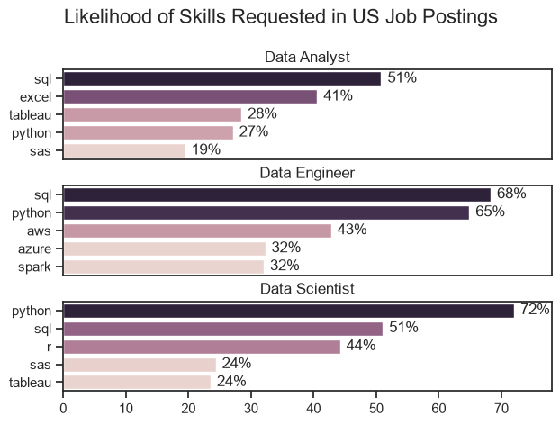

# The Analysis
## 1. What are the most demanded skills for the 3 most popular data roles?

To find the most demanded skills for the top 3 most popular jobs I filtered out those positions by which one were the most popular (more appearances on the dataset), and got the top 5 skills for those roles.
This query highlights the most popular roles and the 5 top skills associated to them, showing what skills I should pay attention to depending on the role I'm targeting.

View my notebook with detailed steps here: 
[2_Skills_Demand.ipynb](2_My_Project/2_Skills_Demand.ipynb)

### Visualizing Data 

```python
fig, ax = plt.subplots(len(job_titles), 1)

sns.set_theme(style='ticks')

for i, job_title in enumerate(job_titles):
   df_plot = df_percent_skills[df_percent_skills['job_title_short'] == job_title].head(5)
   sns.barplot(data=df_plot, x='skills_percent', y='job_skills', ax=ax[i], hue='skills_count')
   ax[i].set_title(job_title)
   ax[i].set_xlabel('')
   ax[i].set_ylabel('')
   ax[i].legend().set_visible(False)
   ax[i].set_xlim(0,78)
   
   for n, v in enumerate(df_plot['skills_percent']):
      ax[i].text(v + 1, n, f'{v:.0f}%', va='center')
   
   if i != len(job_titles) - 1:
      ax[i].set_xticks([])

plt.suptitle('Likelihood of Skills Requested in US Job Postings', fontsize=16)
plt.tight_layout(h_pad=0.5)
plt.show()

```
### Results



### Insights

* Python is one of the most important skills for **Data Engineers** and **Data Scientists**, while it is less common in **Data Analyst** roles, appearing in about **27%** of Data Analyst job postings.
* SQL is a key skill across all three roles, showing how essential it is for working in data.
* Cloud technologies are especially important for **Data Engineer** positions, where working with cloud platforms is a common requirement.
* For **Data Analyst** roles, **Excel** and **data visualization tools** are the second and third most requested skills, highlighting their importance for data analysis and reporting.


## 2. How are in-demand skills trending for Data Analysts?

```python 
df_plot = df_percent.iloc[:,:5]
sns.lineplot(data=df_plot, dashes=False, palette='flare')
sns.set_theme(style='ticks')
sns.despine()

plt.title('Top 5 Skills Trend for Data Analyst Jobs in the US')
plt.ylabel('Likelihood of Skill Mention')
plt.xlabel('2023')
plt.legend().remove()

from matplotlib.ticker import PercentFormatter
ax = plt.gca()
ax.yaxis.set_major_formatter(PercentFormatter(decimals=0))


for i in range(5):
    plt.text(11.2, df_plot.iloc[-1, i], df_plot.columns[i])

plt.tight_layout()
plt.show()
```

### Results


*Line chart visualizing the trending top skills for data analysts in the US in 2023*

### Insights

* **SQL** shows a fairly steady presence in job postings throughout the year, standing out from the other skills by appearing in more than 50% of postings every month.
* **Excel** remains the second most in-demand skill for Data Analysts, although its presence in job postings decreases slightly from August to October.
* **Python, Tableau** and **Power BI** also remain relatively steady throughout the year. Python and Tableau appear in around 30–35% of job postings, while Power BI appears in approximately 20%.

